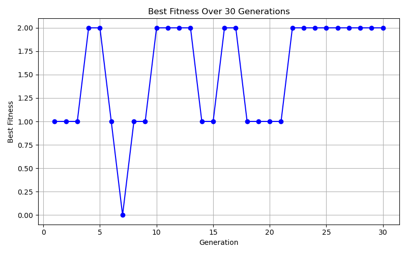
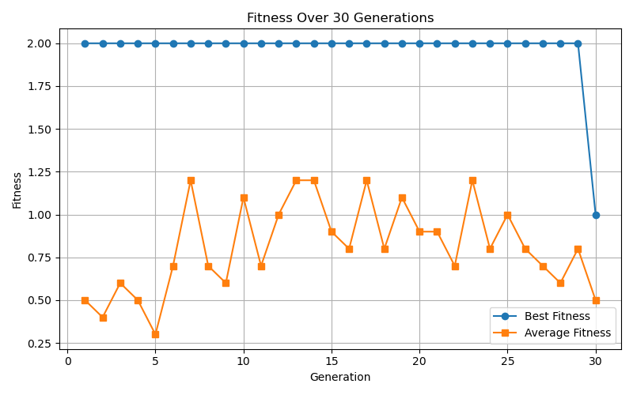
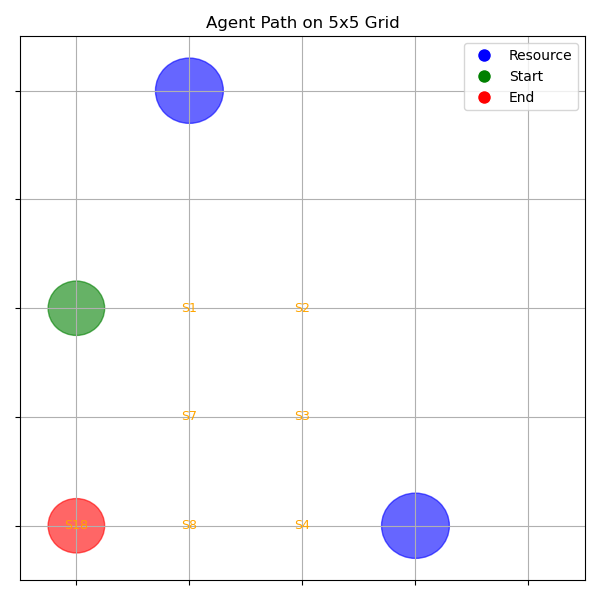
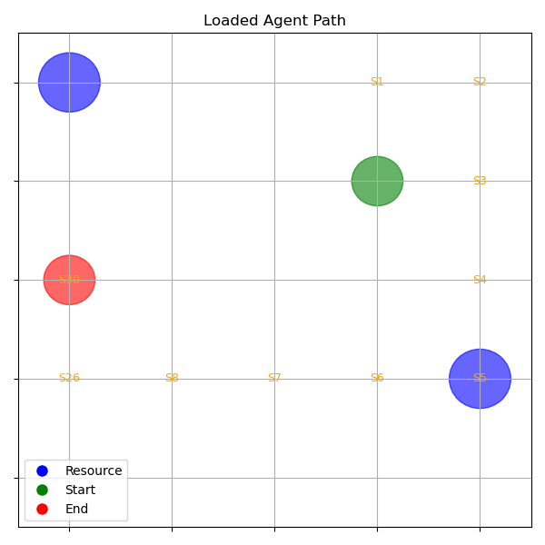

# Neurogenetic Algorithm for Decision Making in Games

A neurogenetic AI framework that combines a neural network with a genetic
algorithm to evolve adaptive decision-making behavior in a grid-based environment.

This project was developed as part of my Master's thesis in Computing and
Information Systems at Youngstown State University.

## Overview

The goal of this project is to explore how an autonomous agent can improve
its decision-making through evolutionary learning rather than traditional
backpropagation.

The agent operates in a 5x5 grid environment containing two resources.
A neural network determines the agent's movement, while a genetic algorithm
evolves the network parameters across generations based on agent performance.

The agent can perform four actions:

- Move up
- Move down
- Move left
- Move right

An agent receives a reward when it successfully reaches and collects a resource.

## Neurogenetic Approach

The learning process follows an evolutionary cycle:

1. Initialize a population of agents with randomly generated neural network weights.
2. Allow each agent to interact with the grid environment.
3. Evaluate each agent based on the number of resources collected.
4. Select the better-performing agents.
5. Combine parent neural network parameters using crossover.
6. Apply Gaussian mutation to introduce variation.
7. Create a new generation of agents.
8. Repeat the process across multiple generations.

Unlike traditional neural network training, this implementation does not use
backpropagation to optimize the network parameters. Instead, the genetic
algorithm searches for better neural network parameters through evolution.

## Neural Network

Each agent contains a lightweight feed-forward neural network.

The network receives an 8-dimensional state representation containing information
about the agent's position and the relative location and direction of the nearest
uncollected resource.

Architecture:

- Input features: 8
- Hidden layer: 8 neurons
- Hidden activation: tanh
- Output layer: 4 action scores
- Actions: up, down, left, right

The action with the highest output score is normally selected. A small probability
of random action selection is also included to encourage exploration.

## Genetic Algorithm

The default experiment uses:

- Population size: 10 agents
- Generations: 30
- Fitness: total resources collected
- Selection: top-performing half of the population
- Crossover: element-wise uniform crossover
- Mutation: Gaussian perturbation of neural network parameters

The maximum resource-based fitness in the environment is 2 because each episode
contains two resources.

## Experimental Results

### Best Fitness Across Generations



The best fitness score is tracked across generations to observe when
high-performing agents emerge during evolutionary training.

### Population Fitness



Tracking both best and average fitness provides a broader view of how the
population changes during training.

## Agent Behavior

The following visualization shows an example trajectory through the 5x5
environment.



After training, the parameters of a selected agent can be saved and loaded
for a separate evaluation run.



The test script records the agent's movements and resource collection behavior,
allowing the evolved policy to be examined after training.

## Project Structure

```text
.
├── agent.py
├── environment.py
├── genetic_algorithm.py
├── main.py
├── neural_network.py
├── test_best_agent.py
└── results/
    ├── agent_path_grid.png
    ├── agent_path_from_saved_weights.png
    ├── best_fitness_over_generations.png
    └── fitness_over_generations.png
